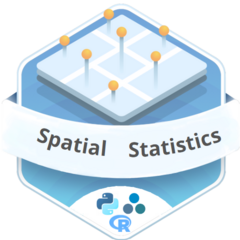

<!-- README.md is generated from README.Rmd. Please edit that file -->

# sdsfun 

<!-- badges: start -->

[](https://CRAN.R-project.org/package=sdsfun)
[](https://CRAN.R-project.org/package=sdsfun)
[](https://CRAN.R-project.org/package=sdsfun)
[](https://stscl.r-universe.dev/sdsfun)
<!-- badges: end -->

**Spatial Data Science Complementary Features**

## Installation

- Install from [CRAN](https://CRAN.R-project.org/package=sdsfun) with:

``` r
install.packages("sdsfun")
```

- Install development binary version from
  [r-universe](https://stscl.r-universe.dev/sdsfun) with:

``` r
install.packages('sdsfun',
                 repos = c("https://stscl.r-universe.dev",
                           "https://cloud.r-project.org"),
                 dep = TRUE)
```

- Install development source version from
  [GitHub](https://github.com/stscl/sdsfun) with:

``` r
# install.packages("devtools")
devtools::install_github("stscl/sdsfun",
                         build_vignettes = TRUE,
                         dep = TRUE)
```
